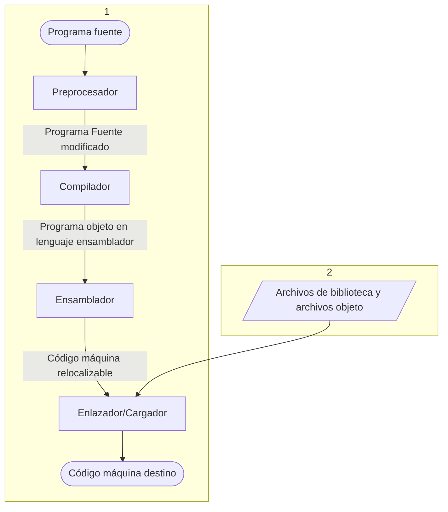

<p  align="center">
    <br>Compiladores  2026-1 <br>
  Práctica 0: Sistema de procesamiento de Lenguaje <br> Profesora: Ariel Adara Mercado Martínez
</p>

### Sistema de procesamiento de Lenguaje

### Objetivo:

Comprender y analizar el funcionamiento de los diferentes programas que intervienen en el proceso de traducción de un programa fuente a un programa ejecutable.

### Introducción

Un compilador es un programa que traduce un programa fuente escrito en un lenguaje de alto nivel a un
programa en lenguaje objeto, usualmente de bajo nivel. Este proceso no se realiza de manera aislada; el
compilador colabora con otros programas como el preprocesador, ensamblador y enlazador.
El preprocesador recopila y expande macros y otros fragmentos de código abreviado en el programa
fuente. Luego, el compilador transforma el código preprocesado en un programa objeto en lenguaje ensamblador, que es posteriormente convertido en código máquina por el ensamblador. Finalmente, el enlazador combina los archivos de código máquina y bibliotecas necesarias para producir un programa ejecutable. El cargador lleva este programa ejecutable a la memoria para su ejecución.



### Desarrollo:

1. Deberá tener instalado el compilador _gcc_ y trabajar en un ámbiente _Linux_.
2. Escriba el siguiente programa en lenguaje **_C_** (sin copiar y pegar) y nómbrelo _programa.c_

```c
#include <stdio .h>
#include <stdlib.h>
//# define PI 3.1415926535897

# ifdef PI
# define area (r) (PI * r * r)
# else
# define area (r) (3.1416 * r * r)
# endif


/**
* Compiladores 2025-2
*
*/
int main ( void ) {
printf ("Hola Mundo !\n"); //Función para imprimir hola mundo
float mi_area = area (3) ; //soy un comentario... hasta donde llegaré ?
printf ("Resultado : %f\n", mi_area);
return 0;
}
```

3. Use el siguiente comando: `cpp programa.c programa.i`
Revise el contenido de _programa.i_ y conteste lo siguiente:

    a.  ¿Qué ocurre cuando se invoca el comando _cpp_ con esos argumentos?
    
    Se realiza el preprocesamiento del programa _programa.c_ y se guarda el resultado en el archivo _programa.i_
    
    b. ¿Qué similitudes encuentra entre los archivos _programa.c_ y _programa.i_? _programa.i_ tiene muchísimas más líneas que _programa.c_ como resultado del procesamiento, sin embargo una parte del código original se encuentra hasta el final del archivo preprocesado.

    c. ¿Qué pasa con las macros y los comentarios del código fuente original en _programa.i_? \
    Los macros son reemplazados en el código cuando se usan, por ejemplo `float mi_area = area(3)` se convierte en `float mi_area = (r) (3.1416 * r * r)(3)`. Los comentarios parecen desaparecer y dejar una línea en blanco en el espacio donde se encontraban.
    
    d. Compare el contenido de _programa.i_ con el de _stdio.h_ e indique de forma general las similitudes entre ambos archivos. \
    _stdio.h_ contiene muchas definiciones de macros y definiciones de variables mientras que _programa.i_ contiene código sin macros.
    
    e.  ¿A qué etapa corresponde este proceso? \
    Al preprocesamiento, incluso está indicado en el nombre del comando: _c preprocessor_

---

4. Ejecute la siguiente instrucción: `gcc -Wall -S programa.i`

    a.  ¿Para qué sirve la opción _\-Wall_? \
    Habilita todas las advertencias para construcciones que son comunmente consideradas cuestionables y fáciles de evitar.

    b.  ¿Qué le indica a gcc la opción _\-S_? \
    Solo compilar, no asemblar o enlazar.

    c.  ¿Qué contiene el archivo de salida y cuál es su extensión? \
    El archivo _programa.s_, su extensión indica que es un archivo en ensamblador.

    d.  ¿A qué etapa corresponde este comando? \
    Pertenece a la etapa de compilación, como se indica en el nombre del comando, _c compiler collection_.

---

5. Ejecute la siguiente instrucción: `as programa.s -o programa.o`
    a.  Antes de revisarlo, indique cuál es su hipótesis sobre lo que debe contener el archivo con extensión _.o_. \
    Ya que el último archivo que conseguimos era en ensamblador tendría sentido que realice el ensamblado del archivo.

    b.  Diga de forma general qué contiene el archivo _programa.o_ y por qué se visualiza de esa manera. \
    Será un programa objeto y no se puede visualizar ya que son instrucciones para la computadora y no para que sean entendidas por humanos.

    c.  ¿Qué programa se invoca con _as_? \
    Invoca al asemblador GNU de Linux.

    d.  ¿A qué etapa corresponde la llamada a este programa? \
    Al asemblado.

---

6. Encuentre la ruta de los siguientes archivos en el equipo de trabajo:

- ld-linux-x86-64.so.2 - `/lib/x86_64-linux-gnu/ld-linux-x86-64.so.2`
- Scrt1.o (o bien, crt1.o) - `/lib/x86_64-linux-gnu/Scrt1.o`
- crti.o - `/usr/lib/x86_64-linux-gnu/crti.o`
- crtbeginS.o - `/usr/lib/gcc/x86_64-linux-gnu/13/crtbeginS.o`
- crtendS.o - `/usr/lib/gcc/x86_64-linux-gnu/13/crtendS.o`
- crtn.o - `/usr/lib/x86_64-linux-gnu/crtn.o`

---

7. Ejecute el siguiente comando, sustituyendo las rutas que encontró en el paso anterior:

```console
ld -o ejecutable -dynamic-linker /lib/ld-linux-x86-64.so.2 /usr/lib/Scrt1.o /usr/lib/crti.o programa.o -lc /usr/lib/crtn.o
```

  a.  En caso de que el comando ld mande errores, investigue como enlazar un programa utilizando el comando _ld_. Y proponga una posible solución para llevar a cabo este proceso con éxito.

  b.  Describa el resultado obtenido al ejecutar el comando anterior. \
  Se creó un archivo ejecutable llamado `ejecutable`, no puede ser visualizado pero al correrlo en terminal con `./ejecutable`.

---

8. Una vez que se enlazó el código máquina relocalizable, podemos ejecutar el programa con la siguiente instrucción en la terminal: `./ejecutable`\
Imprime: 
  ```
  Hola mundo!
  Resultado: 28.274401
  ```

---

9. Quite el comentario de la macro _#define PI_ en el código fuente original y conteste lo siguiente: 

    a.  Genere nuevamente el archivo.i. De preferencia asigne un nuevo nombre. \
    Se preprocesó el nuevo cambio y se guardó en el archivo `descomentado.i`

    b.  ¿Cambia en algo la ejecución final? \
    En el archivo original se utilizó 3.1416 ya que _PI_ no estaba definido, con el nuevo cambio se utiliza 3.1415926535897 como _pi_ lo cual cambia un poco el resultado final.


---

10. Escribe un segundo programa en lenguaje **_C_** en el que agregue 4 directivas del preprocesador
de _**C**_ (_cpp_)[^1]. Las directivas elegidas deben jugar algún papel en el significado del programa, ser distintas entre sí y
diferentes de las utilizadas en el primer programa (aunque no están prohibidas si las requieren).

    a.  Explique su utilidad general y su función en particular para su programa.\
    Un programa similar al anterior pero calcula la circumferencia en vez del área de un círculo, dado su radio

---

11. Redacte un informe detallado con sus resultados y conclusiones.

[^1]: Pueden consultar la lista de directivas en su documentación en línea: [CPP - Index of directives](https://gcc.gnu.org/onlinedocs/cpp/Index-of-Directives.html##Index-of-Directives). O bien, revisar la entrada para este preprocesador en la herramienta man en Linux: `$ man cpp`
