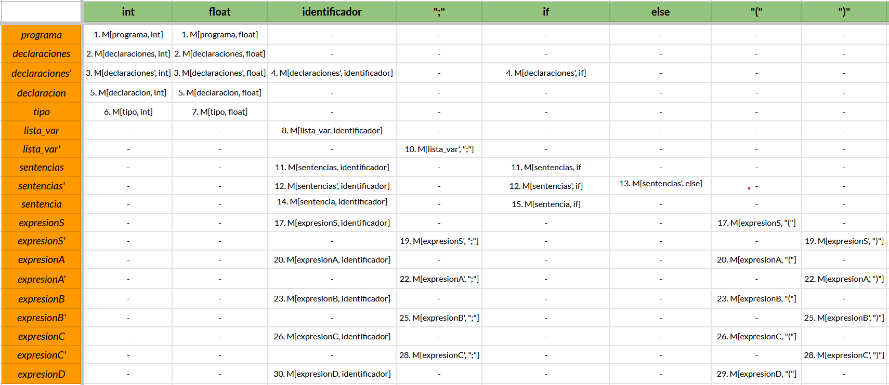
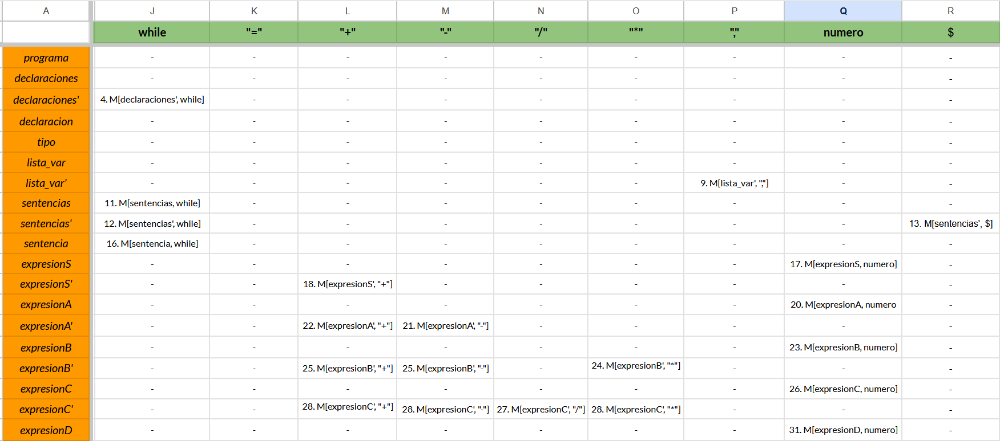

# [Compiladores 2026-1] Grupo 7010 
## Práctica 3 Repositorio base


### Estructura del directorio
```c++
p4
├── README.md
└── src //carpeta de código
    ├── prueba //archivo para I/O test
    ├── lib //carpeta para bibliotecas
    │   └── FlexLexer.h //archivo de cabecera (ignorar)
    ├── Makefile //archivo de reglas de compilación
    ├── main.cpp //contiene la función principal del programa
    ├── Production.cpp //archivo para la clase producción
    ├── lexer.ll //archivo de Flex para generación de `scanner`
    ├── Symbol.cpp //archivo para la clase de símbolo
    ├── Grammar.cpp //archivo para la clase de gramática
    ├── ParserLL.cpp //archivo para parser LL(1)
    └── headers //carpeta de archivos de código
        ├── Lexer.hpp //archivo de cabecera para el scanner
        ├── Symbol.h //archivo de cabecera de símbolo
        ├── Production.h //archivo de cabecera de producción
        ├── Symbols.hpp //archivo de cabecera definición de los conjuntos N y Σ
        ├── Grammar.h //archivo de cabecera de gramática
        └── ParserLL.hpp //archivo de cabecera del parser LL(1)

```

### Uso

#### Compilacion

```bash
$ cd src/
$ make
```

#### Ejecucion

```bash
$ ./compiler prueba
```

#### Ejercicios
Para la gramática G = ( N, Σ, P, S), descrita por las siguientes producciones: 
> P = {
>> programa → declaraciones sentencias <br>
>> declaraciones → declaraciones declaracion | declaracion <br>
>> declaracion → tipo lista-var **;** <br>
>> tipo → **int** | **float** <br>
>> lista_var → lista_var **,** _**identificador**_ | _**identificador**_ <br>
>> sentencias → sentencias sentencia | sentencia <br>
>> sentencia → _**identificador**_ **=** expresion **;** | **if** **(** expresion **)** sentencias **else** sentencias | **while** **(** expresión **)** sentencias <br>
>> expresion → expresion **+** expresion | expresion **-** expresion | expresion __\*__ expresion | expresion **/** expresión | _**identificador**_ | **_numero_** <br>
>> expresion → **(** expresion **)** <br>
}


1. Determinar en un archivo Readme, en formato Markdown (.md) o LaTeX (.tex) - con su respectivo PDF, para este último - , los conjuntos _N_, _Σ_ y el símbolo inicial _S_.  (0.5 pts.) \
    La grámatica es la misma dada para la práctica pasada, por lo tanto esta parte será la misma.
    - $N=\{$ programa, declaraciones, declaracion, tipo, lista_var, sentencias, sentencia, expresion $\}$
    - $\Sigma = \{$**int**, **float**, **identificador**, **;**, **if**, **else**, **(**, **)**, **while**, **=**, **,**, **numero** $\}$
    - $S = \{$ programa $\}$

    a. Mostrar en el archivo el proceso de eliminación de ambigüedad o justificar, en caso de no ser necesario. (0.25 pts.) <br>
        Existe ambiguedad en la regla de expresion en la grámatica, esto debido a que se puede derivar, por ejemplo, la cadena $\text{numero} + \text{numero} * \text{numero}$ de diferentes formas:
        - expresion $\to$ expresion $\textbf{+}$ expresion $\to$ expresion $\textbf{+}$ expresion $\textbf{*}$ expresion
        - expresion $\to$ expresion $\textbf{*}$ expresion $\to$ expresion $\textbf{+}$ expresion $\textbf{*}$ expresion

    Y despues derivando número en cada una de las expresiones anteriores.
    Eliminaremos esto introduciendo diferentes niveles para operaciones, dependiendo de su orden de precedencia, la grámatica queda de la siguiente manera:
    - programa $\to$ declaraciones sentencias
    - declaraciones $\to$ declaraciones declaracion | declaracion
    - declaracion $\to$ tipo lista_var **;**
    - tipo $\to$ **int** | **float**
    - lista_var $\to$ lista_var **, identificador** $\mid$ **identificador**
    - sentencias $\to$ sentencias sentencia $\mid$ sentencia
    - sentencia $\to$ **identificador =** expresionS **;** $\mid$ **if (** expresionS **)** sentencias **else** sentencias $\mid$ **while (** expresionS **)** sentencias
    - expresionS $\to$  expresionS **+** expresionA $\mid$ expresionA
    - expresionA $\to$  expresionA **-** expresionB $\mid$ expresionB
    - expresionB $\to$  expresionB __*__ expresionC $\mid$ expresionC
    - expresionC $\to$  expresionC **/** expresionD $\mid$ expresionD
    - expresionD $\to$ **(** expresionS **)** $\mid$ **identificador** $\mid$ **numero**

    b. Mostrar en el archivo el proceso de eliminación de la recursividad izquierda o justificar, en caso de no ser necesario. (0.25 pts.) <br>
    Basándonos en la grámatica que dí en el inciso anterior las reglas que requieren eliminación de la recursividad izquierda son *declaraciones, lista_var, sentencias y todas las reglas de expresion, con excepción de expresionD*, al eliminarlas con el método visto nos queda de la siguiente forma:
    - programa $\to$ declaraciones sentencias
    - declaraciones $\to$ declaracion declaraciones'
    - declaraciones' $\to$ declaracion declaraciones' $\mid$ $\epsilon$
    - declaracion $\to$ tipo lista_var **;**
    - tipo $\to$ **int** | **float**
    - lista_var $\to$ **identificador** lista_var'
    - lista_var' $\to$ **, identificador** lista_var' $\mid$ $\epsilon$
    - sentencias $\to$ sentencia sentencias'
    - sentencias' $\to$ sentencia sentencias' $\mid$ $\epsilon$
    - sentencia $\to$ **identificador =** expresionS **;** $\mid$ **if (** expresionS **)** sentencias **else** sentencias $\mid$ **while (** expresionS **)** sentencias
    - expresionS $\to$  expresionA expresionS'
    - expresionS' $\to$  **+** expresionA expresionS' $\mid$ $\epsilon$
    - expresionA $\to$  expresionB expresionA'
    - expresionA' $\to$  **-** expresionB expresionA' $\mid$ $\epsilon$
    - expresionB $\to$  expresionC expresionB'
    - expresionB' $\to$  __*__ expresionC expresionB' $\mid$ $\epsilon$
    - expresionC $\to$  expresionD expresionC'
    - expresionC' $\to$  **/** expresionD expresionC' $\mid$ $\epsilon$
    - expresionD $\to$ **(** expresionS **)** $\mid$ **identificador** $\mid$ **numero**
    
    c. Mostrar en el archivo el proceso de factorización izquierda o justificar, en caso de no ser necesario. (0.25 pts.) \
        La grámatica no requiere de factorización izquierda, las reglas que contienen "$\mid$" no son de la forma necesaria $\alpha \beta_1 \mid \dots \mid \alpha \beta_n $
        
    d. Mostrar en el archivo los nuevos conjuntos _N'_ y _P'_, que definen _G'_. (0.25 pts.) <br>
    - $N = \{$ programa, declaraciones, declaraciones', declaracion, tipo, lista_var, lista_var', sentencias, sentencias', sentencia, expresionS, expresionS', expresionA, expresionA', expresionB, expresionB', expresionC, expresionC', expresionD $\}$
    - $P = \{$
        - programa $\to$ declaraciones sentencias
        - declaraciones $\to$ declaracion declaraciones'
        - declaraciones' $\to$ declaracion declaraciones' $\mid$ $\epsilon$
        - declaracion $\to$ tipo lista_var **;**
        - tipo $\to$ **int** | **float**
        - lista_var $\to$ **identificador** lista_var'
        - lista_var' $\to$ **, identificador** lista_var' $\mid$ $\epsilon$
        - sentencias $\to$ sentencia sentencias'
        - sentencias' $\to$ sentencia sentencias' $\mid$ $\epsilon$
        - sentencia $\to$ **identificador =** expresionS **;** $\mid$ **if (** expresionS **)** sentencias **else** sentencias $\mid$ **while (** expresionS **)** sentencias
        - expresionS $\to$  expresionA expresionS'
        - expresionS' $\to$  **+** expresionA expresionS' $\mid$ $\epsilon$
        - expresionA $\to$  expresionB expresionA'
        - expresionA' $\to$  **-** expresionB expresionA' $\mid$ $\epsilon$
        - expresionB $\to$  expresionC expresionB'
        - expresionB' $\to$  __*__ expresionC expresionB' $\mid$ $\epsilon$
        - expresionC $\to$  expresionD expresionC'
        - expresionC' $\to$  **/** expresionD expresionC' $\mid$ $\epsilon$
        - expresionD $\to$ **(** expresionS **)** $\mid$ **identificador** $\mid$ **numero**

        $\}$
2. Mostrar en el archivo la construcción de los conjuntos FIRST de la gramática _G'_. (1 pt.)\
    - FIRST(programa) $=$ $\{$**int**, **float** $\}$
    - FIRST(declaraciones) $=$ $\{$**int**, **float** $\}$
    - FIRST(declaraciones') $=$ $\{$**int**, **float**, $\epsilon$ $\}$
    - FIRST(declaracion) $=$ $\{$**int**, **float** $\}$
    - FIRST(tipo) $=$ $\{$**int**, **float** $\}$
    - FIRST(lista_var) $=$ $\{$ **identificador** $\}$
    - FIRST(lista_var') $=$ $\{$ **,**,  $\epsilon$ $\}$
    - FIRST(sentencias) $=$ $\{$ **identificador**, **if**, **while** $\}$  
    - FIRST(sentencias') $=$ $\{$ **identificador**, **if**, **while**, $\epsilon$ $\}$  
    - FIRST(sentencia) $=$ $\{$ **identificador**, **if**, **while** $\}$  
    - FIRST(expresionS) $=$  $\{$ **(**, **identificador**, **numero**  $\}$
    - FIRST(expresionS') $=$  $\{$ **+**, $\epsilon$ $\}$
    - FIRST(expresionA) $=$  $\{$ **(**, **identificador**, **numero**  $\}$
    - FIRST(expresionA') $=$ $\{$ **-**, $\epsilon$ $\}$
    - FIRST(expresionB) $=$  $\{$ **(**, **identificador**, **numero**  $\}$
    - FIRST(expresionB') $=$  $\{$ __*__, $\epsilon$ $\}$
    - FIRST(expresionC) $=$  $\{$ **(**, **identificador**, **numero**  $\}$
    - FIRST(expresionC') $=$  $\{$ **/**, $\epsilon$ $\}$
    - FIRST(expresionD) $=$ $\{$ **(**, **identificador**, **numero**  $\}$
3. Mostrar en el archivo la construcción de los conjuntos FOLLOW de la gramática _G'_. (1 pt.)
 FIRST(programa) $=$ $\{$**int**, **float** $\}$
    - FOLLOW(programa) $= \{ \$ \}$
    - FOLLOW(declaraciones) $=$ $\{$ $\}$ $\cup$ FIRST(sentencias) $\setminus \{ \epsilon \}$ $= \{$ **identificador**, **if**, **while** $\}$
    - FOLLOW(declaraciones') $=$ $\{$ $\}$ $\cup$ FOLLOW(declaraciones) $\cup$ FOLLOW(declaraciones') $= \{$ **identificador**, **if**, **while** $\}$
    - FOLLOW(declaracion) $=$ $\{$ $\}$ $\cup$ FIRST(declaraciones') $\setminus \{\epsilon\}$ $\cup$ FOLLOW(declaraciones) $\cup$ FOLLOW(declaraciones') $=\{$**int**, **float**, **identificador**, **if**, **while** $\}$
    - FOLLOW(tipo) $=$ $\{$ $\}$ $\cup$ FIRST(lista_var) $\setminus \{\epsilon\}$ $=\{$ **identificador** $\}$
    - FOLLOW(lista_var) $=$ $\{$ **;** $\}$
    - FOLLOW(lista_var') $=$ $\{\}$ $\cup$ FOLLOW(lista_var) $\cup$ FOLLOW(lista_var') $=\{$ **;** $\}$
    - FOLLOW(sentencias) $=$ $\{$ $\}$ $\cup$ FOLLOW(programa) $\cup$ $\{$ **else** $\}$ $\cup$ FOLLOW(sentencia) $=\{$ $\$$, **else**, **identificador**, **if**, **while** $\}$
    - FOLLOW(sentencias') $= \{$ $\}$ $\cup$ FOLLOW(sentencias) $\cup$ FOLLOW(sentencias') $=\{$ $\$$, **else**, **identificador**, **if**, **while** $\}$
    - FOLLOW(sentencia) $=$ FIRST(sentencias') $\setminus \{\epsilon\}$ $\cup$ FOLLOW(sentencias) $\cup$ FOLLOW(sentencias') $\setminus \{ \epsilon \}$ $=\{$ $\$$, **else**, **identificador**, **if**, **while** $\}$
    - FOLLOW(expresionS) $=$  $\{$ **;**, **)** $\}$
    - FOLLOW(expresionS') $=$  $\{$ $\}$ $\cup$ FOLLOW(expresionS) $\cup$ FOLLOW(expresionS') $= \{$ **;**, **)** $\}$
    - FOLLOW(expresionA) $=$  FIRST(expresionS') $\setminus \{\epsilon\}$ $\cup$ FOLLOW(expresionS) $\cup$ FOLLOW(expresionS') $\setminus \{\epsilon \} = $ $\{$ **+**, **;**, **)** $\}$
    - FOLLOW(expresionA') $=$ $\{$ $\}$ $\cup$ FOLLOW(expresionA) $\cup$ FOLLOW(expresionA) $ = \{$ **+**, **;**, **)** $\}$
    - FOLLOW(expresionB) $=$  FIRST(expresionA') $\setminus \{\epsilon\}$ $\cup$ FOLLOW(expresionA) $\cup$ FOLLOW(expresionA') $\setminus \{\epsilon \}$  $=\{$ **-** ,**+**, **;**, **)** $\}$
    - FOLLOW(expresionB') $=$  $\{$ $\}$ $\cup$ FOLLOW(expresionB) $\cup$ FOLLOW(expresionB') $=\{$ **-** ,**+**, **;**, **)** $\}$
    - FOLLOW(expresionC) $=$  FIRST(expresionB') $\setminus \{\epsilon\}$  $\cup$ FOLLOW(expresionB) $\cup$ FOLLOW(expresionB') $\setminus \{\epsilon \}$  $=\{$ __*__ ,**-** ,**+**, **;**, **)** $\}$
    - FOLLOW(expresionC') $=$ $\{$ $\}$ $\cup$ FOLLOW(expresionC) $\cup$ FOLLOW(expresionC') $=\{$ __*__ ,**-** ,**+**, **;**, **)** $\}$
    - FOLLOW(expresionD) $=$ FIRST(expresionC') $\setminus \{\epsilon\}$ $\cup$ FOLLOW(expresionC) $\cup$ FOLLOW(expresionC') $\setminus \{\epsilon \}$  $=\{$ **/** ,__*__ ,**-** ,**+**, **;**, **)** $\}$
4. Mostrar en el archivo la construcción de la tabla de análisis sintáctico predictivo para _G'_. (1 pt.)


Se añade el link con la tabla original: \
https://docs.google.com/spreadsheets/d/1nMl47ksHnaZ1Wb0klJRuiC9Hjo5lz1ePOEkrB6EU3Eo/edit?usp=sharing
5. Sustituir el contenido del Analizador Léxico (lexer.ll) con el implementado en la segunda práctica. (0.5 pts.)
6. Definir en un comentario de _Symbols.hpp_ la gramática _G'_. (0.05 pts.)
7. Definir _Σ_ en un _**enum**_ de _Symbols.hpp_. (0.10 pts.)
8. Definir _N'_ en un _**enum**_ de _Symbols.hpp_. (0.10 pts.)
9. Cargar _N' ∪ Σ_ en _ParserLL.cpp_. (0.25 pts.) 
10. Cargar _P'_ en _ParserLL.cpp_. (0.25 pts.)
11. Cargar la tabla de análisis sintáctico predictivo en _ParserLL.cpp_. (0.25 pts.)
12. Implementar el algoritmo de análisis sintáctico de descenso predictivo en _ParserLL.cpp_ de modo que el programa acepte el archivo _prueba_. (4 pts.)
---
#### Extras

13. Documentar el código. (0.25pts)
14. Proponer 4 archivos de prueba nuevos, 2 válidos y 2 inválidos. (0.25pts)
